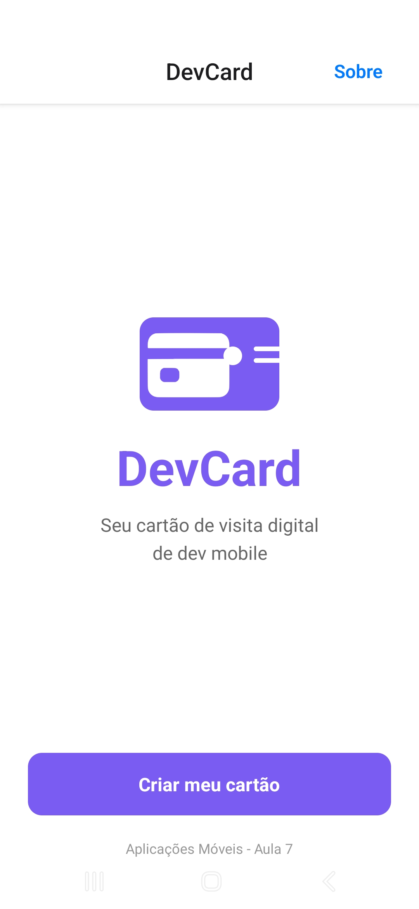
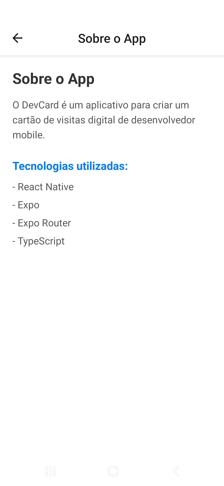
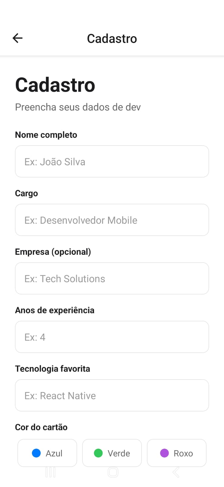
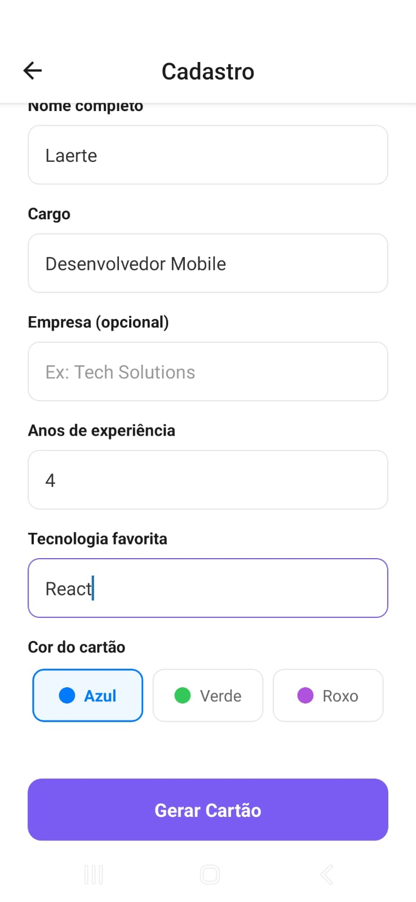
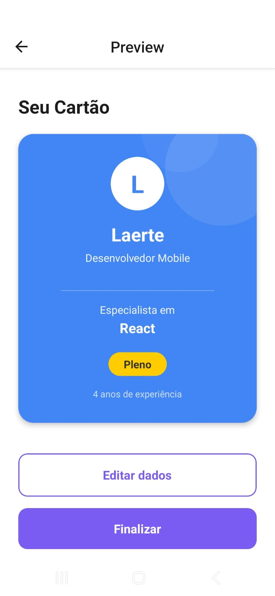

# DevCard

Um aplicativo desenvolvido para criar e compartilhar cartões de visitas digitais personalizados para desenvolvedores, reunindo informações profissionais, contatos, redes sociais e portfólio em um só lugar.

Autor: Laerte de Lara Ferreira Mendes Junior

# Print 

Print das telas

  
  
  
  
  
  

